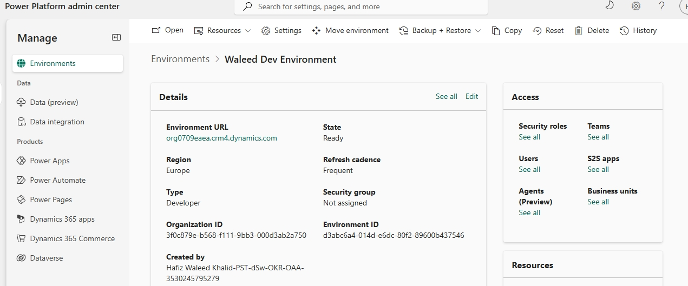
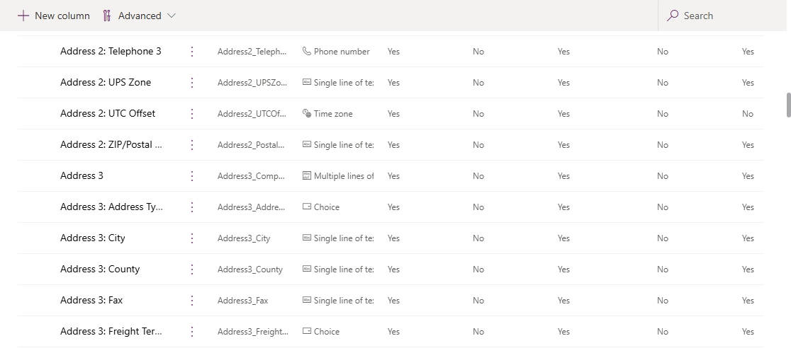

# 🏗️ Enterprise IT Helpdesk System

**Platform:** Microsoft Power Platform and Microsoft Dataverse  
**Developer:** Hafiz Waleed Khalid  
**Status:** 🟡 In Progress — Week 2 of 8

---

## 📋 Project Overview

A fully functional, enterprise-grade IT support ticket management system — built from scratch on Microsoft Power Platform and Dataverse.

This is not a tutorial copy. Every design decision, table structure, security model, and automation is planned and built following real enterprise standards — the same way a consulting firm would deliver it to a client.

---

## 🎯 What This Project Demonstrates

- Dataverse data modeling and relational database design
- Custom table creation with proper naming conventions
- Relationships — Lookup, One-to-Many, Many-to-Many
- Power Apps — Canvas and Model Driven App development
- Power Automate — automated ticket assignment and notifications
- Power BI — live management dashboard
- Enterprise security roles and row-level access control
- ALM — solution deployment from Dev to Test to Production

---

## 🗂️ Project Structure

```
Enterprise-IT-Helpdesk-PowerPlatform/
│
├── 📁 screenshots/
│   ├── Week1-Environment-Setup.png
│   ├── Week1-Contact-Table-Columns.png
│   └── (added weekly)
│
├── 📁 data-model/
│   └── IT-Helpdesk-DataModel.md
│
├── 📁 docs/
│   └── solution-design.md
│
└── README.md
```

---

## 📊 Build Progress

| Week | Milestone | Status |
|------|-----------|--------|
| Week 1 | Environment Setup and Architecture Design | ✅ Complete |
| Week 2 | Data Modeling in Dataverse | 🔄 In Progress |
| Week 3 | Security Roles and Access Control | ⏳ Coming Soon |
| Week 4 | Power Apps UI — Canvas and Model Driven | ⏳ Coming Soon |
| Week 5 | Power Automate Flows and Business Logic | ⏳ Coming Soon |
| Week 6 | Power BI Reporting and Dashboard | ⏳ Coming Soon |
| Week 7 | ALM and Deployment to Production | ⏳ Coming Soon |
| Week 8 | Final Review and Documentation | ⏳ Coming Soon |

---

## 🗄️ Data Model

### Tables Being Built

| Table | Type | Purpose |
|-------|------|---------|
| IT Ticket | Custom | Core record — every support request |
| Category | Custom | Controlled list — Hardware, Software, Network |
| Contact | Standard | Employees who raise tickets |
| Account | Standard | Departments or organizations |

### Key Relationships

| From Table | To Table | Relationship Type |
|------------|----------|-------------------|
| IT Ticket | Contact | Many tickets → One employee |
| IT Ticket | Category | Many tickets → One category |
| IT Ticket | Contact (Assigned To) | Many tickets → One IT staff member |

---

## 📸 Screenshots

### Week 1 — Environment Setup and Architecture Design

*Waleed Dev Environment successfully created — Type: Developer, Status: Ready, Dataverse: Enabled*

### Week 1 — Contact Table Columns in Dataverse

*Real Dataverse table showing Lookup (Foreign Key) and Unique Identifier (Primary Key) fields*

### Week 2 — Data Model
<!-- ADD Week2-DataModel.png here -->
*Custom tables and relationships in Dataverse*

*(Screenshots added at the end of each week)*

---

## 🏛️ Architecture Decisions

| Decision | Choice Made | Reason |
|----------|-------------|--------|
| Environment | Separate Dev environment | Never build in Production |
| Table naming | PascalCase — IT_Ticket | Enterprise naming convention |
| Data type for Category | Lookup field | Prevents free-text errors and data integrity issues |
| Solution type | Custom solution | Never build in Default Solution |
| IT Ticket | Custom table | No standard table covers this |
| Category | Custom table with Lookup | Prevents free text errors |
| Employees | Reuse Contact table | Already built by Microsoft |

---

## 📝 Lessons Learned

*(Updated weekly — real observations from building this project)*

**Week 1:**
- Always create a separate Developer environment before touching anything
- Standard tables like Account and Contact already exist in Dataverse — no need to rebuild them
- Environment region affects data residency — important for enterprise clients
- Lookup field is Dataverse's name for Foreign Key
- Unique Identifier is Dataverse's name for Primary Key
- Choice field = small fixed list, Lookup field = growing list with its own table
- Power Platform tools all share one Dataverse backbone

**Week 2:**
- *(Coming Soon)*

---

## 🔗 Connect

| Platform | Link |
|----------|------|
| **GitHub Profile** | [github.com/HafizWaleedKhalid](https://github.com/HafizWaleedKhalid) |
| **LinkedIn** | [linkedin.com/in/hafiz-waleed-khalid-0b17842b8](https://linkedin.com/in/hafiz-waleed-khalid-0b17842b8) |

---

*Last Updated: June 2026*  
*This repository is updated weekly as each phase completes.*
